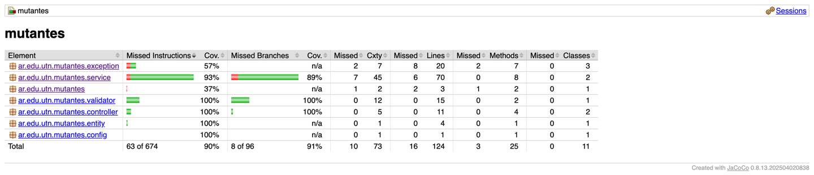

# 🧬 Proyecto Mutantes – Examen MercadoLibre  
_API REST para detección de mutantes usando análisis de secuencias de ADN._

---

## 📌 Descripción General

Este proyecto implementa una API REST que determina si una secuencia de ADN pertenece a un mutante según el desafío propuesto por MercadoLibre.

El sistema:

- Recibe un ADN NxN en formato JSON.
- Valida la estructura y caracteres permitidos.
- Ejecuta un algoritmo optimizado para detectar secuencias de 4 letras iguales (horizontal, vertical y diagonales).
- Guarda el resultado en una base H2 en memoria.
- Expone estadísticas globales.
- Cuenta con test unitarios, de integración, validaciones personalizadas y reporte de cobertura Jacoco.

---

## 🚀 Tecnologías Utilizadas

- **Java 21**
- **Spring Boot 3.5.8**
- **H2 Database**
- **Spring Web**
- **Spring Data JPA**
- **Jakarta Validation**
- **Mockito + JUnit 5**
- **Jacoco (cobertura tests)**
- **Swagger / OpenAPI**

---

## 📁 Estructura del Proyecto (Real)

```

src/main/java/ar/edu/utn/mutantes/
├── config/
│   └── SwaggerConfig.java
├── controller/
│   ├── MutantController.java
│   └── StatsController.java
├── dto/
│   ├── DnaRequest.java
│   └── StatsResponse.java
├── entity/
│   └── DnaRecord.java
├── exception/
│   ├── InvalidDnaException.java
│   ├── InvalidDnaExceptionHandler.java
│   └── GlobalExceptionHandler.java
├── repository/
│   └── DnaRecordRepository.java
├── service/
│   ├── MutantValidator.java
│   ├── MutantDetector.java
│   └── MutantService.java
└── MutantesApplication.java

```

### 🧪 Tests

```

src/test/java/ar/edu/utn/mutantes/
├── controller/
│   ├── MutantControllerTest.java
│   └── StatsControllerTest.java
├── exception/
│   └── InvalidDnaExceptionHandlerTest.java
├── integration/
│   └── MutantIntegrationTest.java
├── repository/
│   └── DnaRecordRepositoryTest.java
├── service/
│   ├── MutantDetectorTest.java
│   └── MutantServiceTest.java
├── validator/
│   └── DnaValidatorTest.java
└── MutantesApplicationTests.java

````

---

## 📘 ENDPOINTS

### ▶ **POST /mutant**

Determina si un ADN es mutante.

#### Request:
```json
{
  "dna": ["ATGCGA","CAGTGC","TTATGT","AGAAGG","CCCCTA","TCACTG"]
}
````

#### Respuestas:

* **200 OK** → Mutante
* **403 Forbidden** → Humano
* **400 Bad Request** → ADN inválido

---

### ▶ **GET /stats**

Devuelve estadísticas acumuladas.

#### Response:

```json
{
  "countMutantDna": 40,
  "countHumanDna": 100,
  "ratio": 0.4
}
```

---

## 🧬 Algoritmo de Detección

El proyecto detecta mutantes cuando se encuentran **2 o más secuencias de 4 letras iguales (A,T,C,G)** en alguna de las siguientes direcciones:

✔ Horizontal
✔ Vertical
✔ Diagonal descendente
✔ Diagonal ascendente

La detección se detiene antes si ya se encuentran 2 secuencias (“early termination”).

---

# 🏛 Arquitectura del Proyecto

La aplicación sigue una arquitectura en **capas con responsabilidades claras**:

```
CLIENTE (Postman/Navegador)
          ↓
[Controller]
          ↓
[DTO]
          ↓
[Service]
          ↓
[Repository]
          ↓
[Entity]
          ↓
[H2 Database]
```

---

# 🎞 Diagrama de Secuencia (Completo)

Este diagrama representa **todo el flujo real** de tu aplicación, incluyendo:

* Controller
* DTO
* Validaciones
* Servicio
* Detector
* Repositorio
* Excepciones
* StatsController


---

## 🧪 Testing

### ✔ Ejecución de Tests

```bash
./gradlew test
```

### ✔ Ejecutar un test específico

```bash
./gradlew test --tests MutantDetectorTest
```

---

## 📊 Cobertura de Código (Jacoco)

Para generar el reporte:

```bash
./gradlew test jacocoTestReport
```



Luego abrir:

```
build/reports/jacoco/test/html/index.html
```

### Resultado Actual

✔ **91% de cobertura global**
✔ Todos los tests pasan
✔ Cobertura completa de controller, service, validator y parte del detector
✔ Excepciones cubiertas

---

## 🗃 Base de Datos H2

URL:
`http://localhost:8080/h2-console`

JDBC URL:
`jdbc:h2:mem:mutantesdb`

Tabla creada automáticamente:

```
dna_records(
   id BIGINT AUTO_INCREMENT,
   dna_hash VARCHAR UNIQUE,
   is_mutant BOOLEAN
)
```

---

## 🧾 Cómo Ejecutar la App

### Con Gradle:

```bash
./gradlew bootRun
```

### Acceso a Swagger:

`http://localhost:8080/swagger-ui/index.html`

---

## 🏁 Conclusión

Este proyecto cumple con:

✔ Validaciones robustas
✔ Arquitectura clara
✔ Manejo de errores centralizado
✔ Capa de servicio bien separada
✔ Tests unitarios, integración y cobertura
✔ Documentación completa
✔ Diagrama de secuencia y estructura profesional
